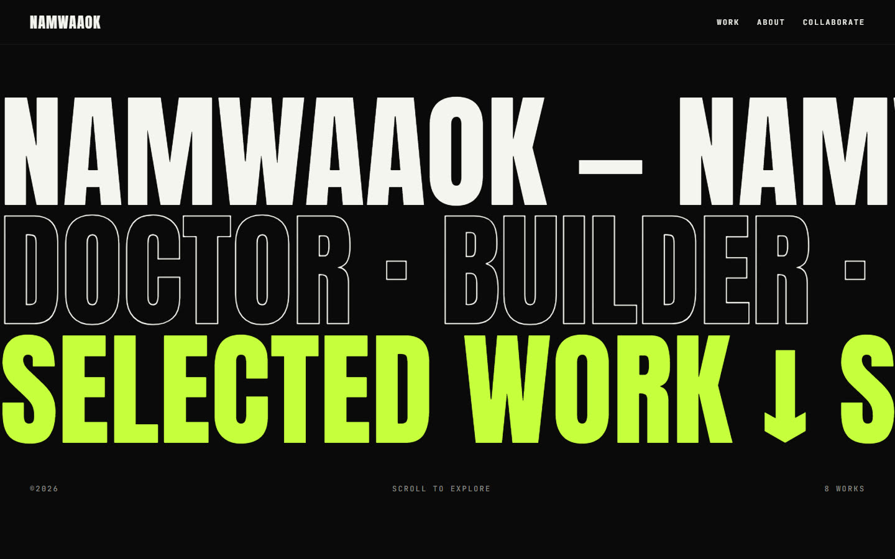
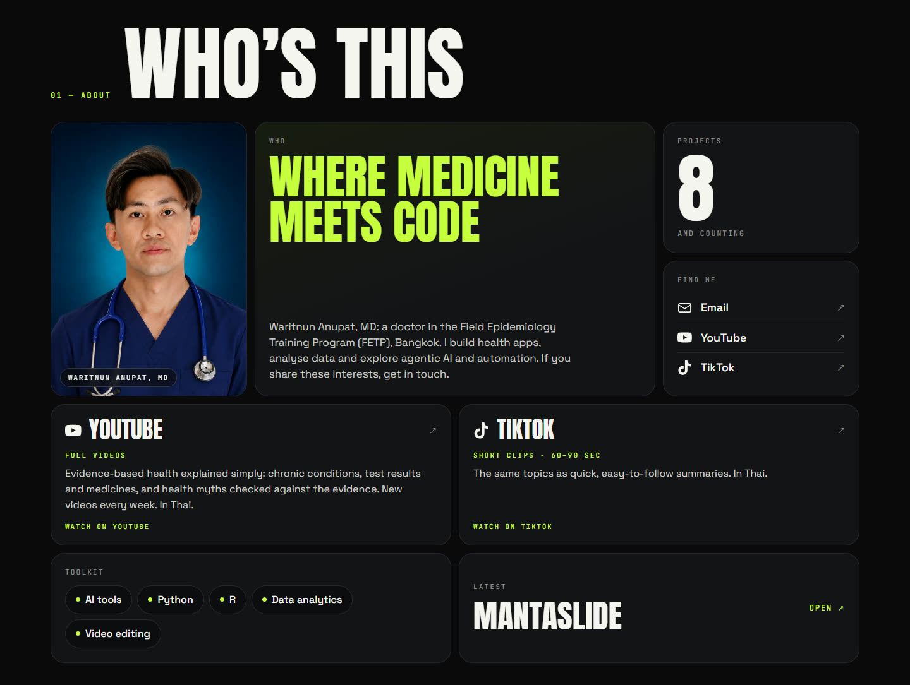
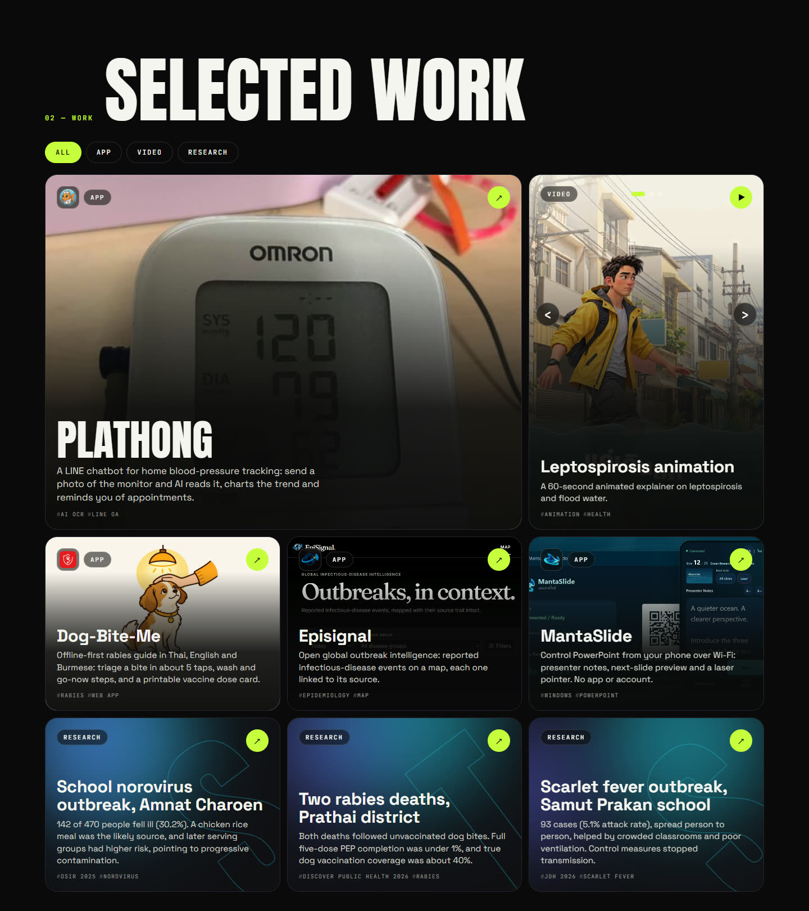
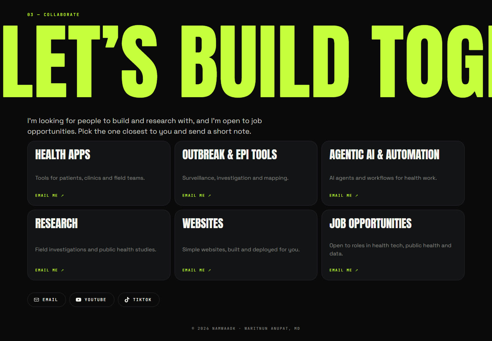

# NAMWAAOK portfolio

Portfolio of **Waritnun Anupat, MD**: a doctor in the Field Epidemiology Training Program (FETP), Bangkok, who builds health apps, analyses data and explores agentic AI and automation. It collects his apps, videos and published outbreak research in one place and invites collaboration.

**Live site: [namwaaok.vercel.app](https://namwaaok.vercel.app)**



## What's on the page

| Section | What it shows |
|---|---|
| **Hero** | Three rows of kinetic type that speed up as you scroll, after a short loading counter. |
| **About** | Portrait, bio, project counter, toolkit (AI tools, Python, R, data analytics, video editing), contact links, a "Latest" tile, and YouTube and TikTok tiles that describe each channel in Thai or English depending on the visitor's browser language. |
| **Work** | A bento grid of apps, a video and three first-author papers, with filter tabs (All, App, Video, Research). Video tiles play in a pop-up player. |
| **Collaborate** | One-click, pre-filled emails for health apps, outbreak and epi tools, agentic AI, research, simple websites, and job opportunities. |







## Featured work

- **Plathong**: a LINE chatbot for home blood-pressure tracking. Send a photo of the monitor and AI reads it, charts the trend and reminds you of appointments.
- **Dog-Bite-Me**: an offline-first rabies guide in Thai, English and Burmese.
- **Episignal**: open global outbreak intelligence with every event linked to its source.
- **MantaSlide**: control PowerPoint from your phone over Wi-Fi.
- **Research**: norovirus (OSIR 2025), human rabies deaths (Discover Public Health 2026) and scarlet fever (JDH 2026) outbreak investigations.

## Tech

Static site, no build step: HTML, CSS and vanilla JavaScript (ES modules) with [GSAP](https://gsap.com) and ScrollTrigger loaded from a CDN. Fonts are Anton, Space Grotesk and JetBrains Mono from Google Fonts. Brand icons come from [Simple Icons](https://simpleicons.org) (CC0).

Good to know:

- Content lives in two JSON files and never touches the code.
- Respects the OS "reduce motion" setting (marquees stay still, reveals become simple fades). Add `?motion=on` to the URL to preview the full animation anyway.
- If GSAP fails to load, the page still shows all content. If the data files fail to load, visitors see a friendly fallback with a YouTube link.
- Layout adapts from phone to desktop.

## Run locally

```bash
py -m http.server 8080
```

Then open http://localhost:8080. On Windows you can also double-click `start.bat`. (Opening `index.html` straight from disk won't work, because browsers block the JSON requests.)

## Edit the content

- `data/site.json`: name, tagline, hero line, bio, skills, photo, email, which project is "Latest", social links, the YouTube/TikTok channel descriptions (`channels`, each with `en` and `th` text) and the collaboration cards.
- Add `?lang=th` or `?lang=en` to the URL to preview the Thai or English text.
- `data/projects.json`: one block per project, video or paper. Required: `title`, `type`, and `link` (or `video`). Optional: `description`, `year`, `featured`, `tags`, `image`, `imageFit`, `imagePos`, `coverColor`, `logo`, `poster`, `fullTitle`.

A new `type` automatically gets its own filter tab and colour.

## Deploy

Pushing to `main` redeploys the site on Vercel. Local-only files (planning docs, the unoptimised original photo, these README screenshots) are excluded from the deployment by `.vercelignore`. Keep that file up to date: the Vercel CLI ignores `.gitignore`.

## Rights

The text, photo, videos and project artwork belong to Waritnun Anupat. No open-source licence has been chosen yet, so please ask before reusing them.
